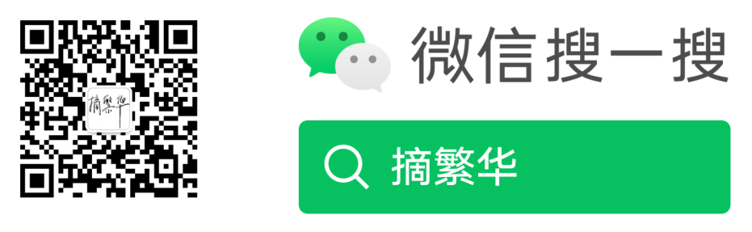

 |  | 

[曦寒懿官方交流群](https://qm.qq.com/q/qYp1Urv3z2) 462371834 | [在线文档](https://docs.xihanfun.com)

# XiHan.UI（实验性）

曦寒界面存储库。快速、轻量、高效、用心的组件库，基于 Vue 构建。

## 📋 项目概况

XiHan.UI 是一个基于 Vue 3 的企业级组件库，致力于提供快速、轻量、高效的组件解决方案。

- **技术栈**: Vue 3 + TypeScript + Vite + Turbo
- **架构**: Monorepo 架构（pnpm workspace，`packages/*` + `internal/*` + `playground`）
- **当前版本**: v0.9.8（实验阶段，尚未正式发布至 npm）
- **workspace 包**: cli / components / constants / directives / hooks / icons / locales / plugins / themes / utils / xihan-ui，共 11 个

## 🧩 组件现状

`packages/components` 目前收录 60 个组件目录，整体仍处于早期重写阶段，请勿在生产环境中依赖：

- **已完整实现**: Button、Icon（含完整交互逻辑与样式）
- **接口占位/重写中（58 个）**: 其余组件（如 Table、Form、Select、DatePicker、Tree 等）目前仅有 props/interface 类型定义与占位渲染骨架（渲染为空的 `
` 包裹 `slot`），尚未实现真实交互逻辑与样式

后续将按组件逐个补齐实现与测试后再发布，欢迎关注仓库进展或参与共建。

## 🎯 项目目标

### 核心理念

- **快速**: 高性能的组件实现，优化渲染性能
- **轻量**: 按需加载，减少打包体积
- **高效**: 开发体验优化，提升开发效率
- **专业**: 企业级标准，满足复杂业务需求

## 🛠️ 技术架构

### 构建工具

- **Turborepo**: Monorepo 任务编排与增量构建
- **Unbuild**: 组件包构建（`packages/components` 等使用）
- **Rollup**: 底层打包工具（经 `@xihan-ui/build` 封装）
- **Vite**: playground 预览/开发服务器

### 开发工具

- **TypeScript**: 类型系统
- **ESLint**: 代码检查
- **Prettier**: 代码格式化
- **Vitest**: 单元测试
- **Vue Test Utils**: 组件测试

### 发布流程

- **pnpm workspace**: 包管理与 `workspace:*` 版本关联
- **npm**: 包发布（规划中，当前 v0.9.8 处于实验阶段，尚未正式发布）
- **changesets / GitHub Actions CI-CD**: 尚未接入，规划中

## 🤝 贡献指南

### 开发流程

1. Fork 项目到个人仓库
2. 创建功能分支
3. 完成开发和测试
4. 提交 Pull Request
5. 代码评审和合并

### 代码规范

- 遵循 ESLint 和 Prettier 配置
- 使用 TypeScript 编写代码
- 编写单元测试
- 更新相关文档

### 提交规范

- 使用 conventional commits 规范
- 提供清晰的提交信息
- 关联相关 Issue

## 支持&赞助

如果此项目对你的开发有助益，也欢迎请作者一杯咖啡。

官方赞助页 https://docs.xihanfun.com/cosmos/sponsor

## 关注动态

## 版权&授权

Copyright (c) 2026 XiHanFun and ZhaiFanhua

本项目采用 MIT 授权，详见 [License](./LICENSE)

XiHan.UI Logo、XiHan.UI名称、界面视觉设计与原创视觉表达归作者所有，第三方依赖和第三方服务分别遵循其各自授权与服务条款。

项目仅供学习参考，作者不承担任何软件的使用风险。
