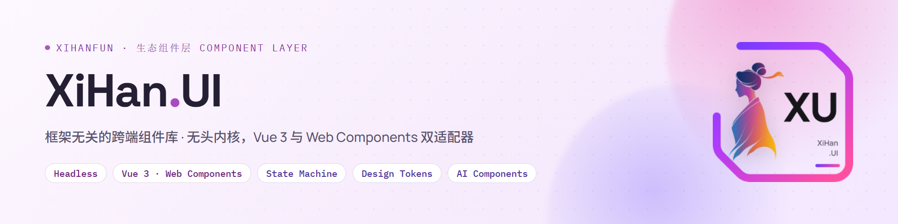

<div align="center">

<h1>XiHan.UI</h1>

<p><b>快速、轻量、高效、用心的框架无关 Headless UI 组件库</b></p>

<p>以 Headless Core 为核心，提供 Vue 3 与 Web Components 双端适配，构建可组合、可访问、可主题化的现代 UI 基础设施</p>

<p>
  <a href="https://github.com/XiHanFun/XiHan.UI/stargazers"></a>
  <a href="https://gitee.com/XiHanFun/XiHan.UI"></a>
  <a href="https://gitcode.com/XiHanFun/XiHan.UI"></a>
</p>

<p>
  
  
  
  <a href="https://www.npmjs.com/package/@xihan-ui/vue"></a>
  <a href="./LICENSE"></a>
</p>

<p>
  <a href="https://ui.docs.xihanfun.com"></a>
  <a href="https://deepwiki.com/XiHanFun/XiHan.UI"></a>
  <a href="https://qm.qq.com/q/qYp1Urv3z2"></a>
</p>

</div>

> **实验性项目**：119 个组件的无头内核、双适配器与默认皮肤均已实现，npm 上是 `1.0.0-alpha.3` **预发布版**，不承诺语义化版本、接口仍会变，请勿在生产环境依赖。

## 简介

XiHan.UI 以框架无关的 Headless Core 为核心：一个组件的状态、交互与无障碍逻辑沉在无头内核里，各框架只写一层薄适配器。同一份 `connect()` 产出在 Vue 与 Web Components 两端跑同一套一致性测试，逐帧比对归一化后的 DOM，以此证明「框架无关」不是口号。属于曦寒懿（XiHanFun）开源生态的组件层，拥有底座、组件、应用的完整生态。

## 特性

- **框架无关** - 状态与无障碍逻辑住在无头内核，Vue 与 Web Components 两端行为一致
- **119 个组件** - 覆盖通用、数据录入、数据展示、导航、反馈与浮层、AI 对话、布局七组
- **近乎零依赖** - 运行时第三方依赖只有 `@internationalized/date`；浮层定位、虚拟滚动、代码着色、流式 Markdown 均为自研
- **构建期样式** - 令牌从 DTCG 源产出 CSS 变量，皮肤按 `@layer` 分层，运行时不做 CSS-in-JS
- **主题可切** - 明暗、品牌、密度、对比度、书写方向五个维度独立切换
- **无障碍** - 键盘交互依 W3C APG 落地，无障碍扫描跑在真实 Chromium 上
- **TypeScript** - 全量类型定义，编辑器内可查

## 安装

17 个公开包均已发布至 npm，当前版本 `1.0.0-alpha.3`（`latest` 与 `alpha` 两个 tag 同指这一版）。

```bash
pnpm add @xihan-ui/vue @xihan-ui/tokens @xihan-ui/styles
```

## 使用

两个适配器共用同一份令牌与皮肤，在入口处各引一次：

```ts
import { createThemeController } from '@xihan-ui/tokens/runtime'
import '@xihan-ui/tokens/tokens.css'
import '@xihan-ui/styles'

createThemeController({ storageKey: 'app-theme' })
```

Vue：

```vue
<script setup lang="ts">
import { XhDialogContent, XhDialogRoot, XhDialogTitle, XhDialogTrigger } from '@xihan-ui/vue'
</script>

<template>
  <XhDialogRoot v-slot="{ setOpen }">
    <XhDialogTrigger>打开对话框</XhDialogTrigger>
    <XhDialogContent>
      <XhDialogTitle>确认操作</XhDialogTitle>
      <button @click="setOpen(false)">关闭</button>
    </XhDialogContent>
  </XhDialogRoot>
</template>
```

Web Components：元素不生成结构，作者写带 `data-xh-part` 的 Light-DOM 子节点，元素把 `connect()` 产出打上去。

```ts
import { defineXhElements } from '@xihan-ui/web-components/define'

defineXhElements()
```

```html
<xh-dialog>
  <button data-xh-part="trigger">打开对话框</button>
  <div data-xh-part="backdrop"></div>
  <div data-xh-part="positioner">
    <div data-xh-part="content">
      <h2 data-xh-part="title">确认操作</h2>
      <button data-xh-part="close-trigger">关闭</button>
    </div>
  </div>
</xh-dialog>
```

## 文档

<https://ui.docs.xihanfun.com> —— 组件页由 headless 产物与类型生成，含 connect API、键盘表与状态图。

## 兼容环境

现代浏览器（Chrome / Edge / Firefox / Safari 最新两个版本），本地开发需 Node.js 24+ 与 pnpm 11+。

## 本地开发

```bash
cd ui
pnpm install --frozen-lockfile
pnpm test         # 单元测试与跨适配器一致性测试
pnpm test:browser # 真实 Chromium 里的无障碍扫描与浮层定位契约
pnpm build
```

首次跑浏览器态测试前需 `pnpm exec playwright install chromium`。

要在本地看组件跑起来，先 `cd ui && pnpm build`，再起文档站——每个组件页的示例引的都是真实组件，Vue 与 Web Components 两套写法并排：

```bash
cd docs
pnpm install
pnpm dev
```

改动需通过 CI 全套门禁，CI 与本地同一套命令：`pnpm lint`、`pnpm typecheck`、`pnpm boundaries`、`pnpm gate`（一条命令跑 58 项结构检查）、`pnpm test`、`pnpm build`、`pnpm size` 等。包一览、分层拓扑与命名约定见 [ui/README_cn.md](./ui/README_cn.md)。

## 现状与边界

已经能用的：119 个组件的内核与双适配器、默认皮肤、设计令牌与主题运行时、跨适配器一致性套件、真实 Chromium 里的无障碍扫描与浮层定位契约、文档站。

还没做的：内建语言包（组件文案只内建英文，中文等要自备 `translations`，全局注入口已就绪）、令牌浏览器、AI 组件族的 MarkdownStream / Reasoning 与 ToolCall 折叠 / 工具审批、企业业务组件。

## 相关项目

- [XiHan.Framework](https://github.com/XiHanFun/XiHan.Framework) - .NET 模块化开发框架
- [XiHan.BasicApp](https://github.com/XiHanFun/XiHan.BasicApp) - 基于 XiHan.Framework 与 Vue 3 的企业级中后台内核

## 贡献

欢迎提交 Issue 和 Pull Request。提交遵循 conventional commits 规范，改动需通过上述门禁。

## 诚挚致谢

排名不分先后。

| 项目 | 致谢 |
| --- | --- |
| [Zag.js](https://github.com/chakra-ui/zag) | 作为组件状态图与 ARIA 接线的规格参考 |
| [W3C APG](https://www.w3.org/WAI/ARIA/apg/) | 作为无障碍交互模式的规范依据 |
| [CommonMark](https://spec.commonmark.org/) | 作为 Markdown 语义与一致率判据的规范来源 |
| [axe-core](https://github.com/dequelabs/axe-core) | 作为无障碍自动化扫描的引擎 |
| 其他第三方依赖 | 作为项目功能丰富与拓展的基石 |

## 支持&赞助

如果此项目对你的开发有助益，也欢迎请作者一杯咖啡。

官方赞助页 https://docs.xihanfun.com/cosmos/sponsor

## 版权&授权

Copyright (c) 2021-Present XiHanFun and contributors.

本项目采用 MIT 授权，详见 [License](./LICENSE)

XiHan.UI Logo、XiHan.UI名称、界面视觉设计与原创视觉表达归作者所有，第三方依赖和第三方服务分别遵循其各自授权与服务条款。

项目仅供学习参考，作者不承担任何软件的使用风险。
